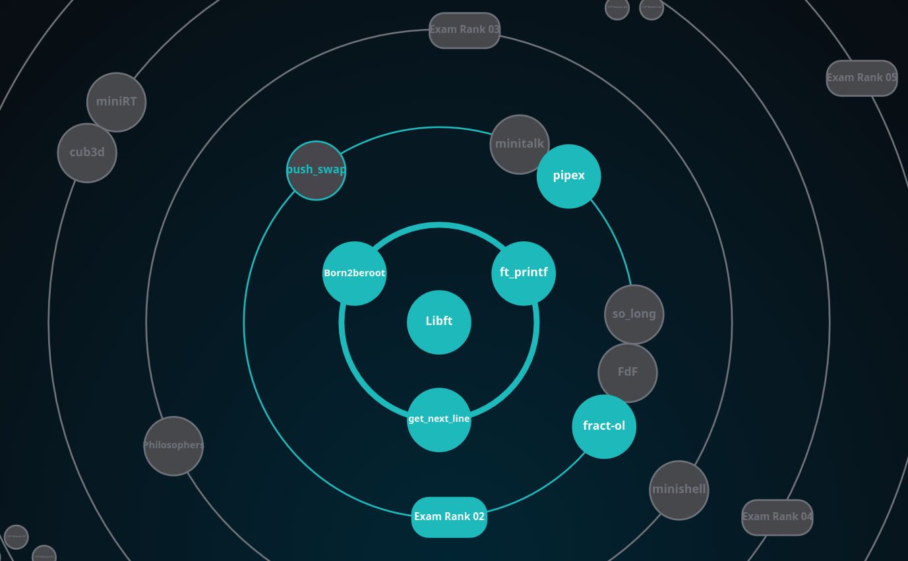

# 42SP - Projects - roadmap

<h2 align="center">
	Piscine Mar 23
</h2>

	

<strong>Developed during Pool, March 2023.</strong> 

* [`EuAceito`](https://github.com/evertonportela/42cursus-Piscine-C/tree/main/0.%20euaceito)	- First challenge involving git commands.
* [`Shell 00`](https://github.com/evertonportela/42cursus-Piscine-C/tree/main/1.%20shell00/)	- Challenges involving shell terminal commands.
* [`Shell 01`](https://github.com/evertonportela/42cursus-Piscine-C/tree/main/2.%20shell01/)	- Challenges involving plus shell terminal commands.
* [`C 00`](https://github.com/evertonportela/42cursus-Piscine-C/tree/main/3.%20C00/)	- Challenges involving C programm language.
* [`C 01`](https://github.com/evertonportela/42cursus-Piscine-C/tree/main/4.%20C01/)	- Challenges involving C programm language.
* [`C 02`](https://github.com/evertonportela/42cursus-Piscine-C/tree/main/5.%20C02/)	- Challenges involving C programm language.
* [`C 03`](https://github.com/evertonportela/42cursus-Piscine-C/tree/main/6.%20C03/)	- Challenges involving C programm language.
* [`C 04`](https://github.com/evertonportela/42cursus-Piscine-C/tree/main/7.%20C04/)	- Challenges involving C programm language.
* [`Rush 00`](https://github.com/evertonportela/42cursus-Piscine-C/tree/main/Rush00/)	- Challenges involving C programm language.

Sorry, i only made it this far...

<h2 align="center">
	Warm Up Abr 23
</h2>

<strong>Developed during the step cadet, April 2023 - The Project Warm Up.</strong> 

* [`P2P 101`](#)	- Development of Non-aggressive Communication.
* [`Basecamp-Reloaded`](https://github.com/evertonportela/42cursus-00-Warm-Up/tree/main/Basecamp-Reloaded)	- Returning from the 42school selection process, remembering exercices.

<h2 align="center">
	42 cursus Commom Core
</h2>

	

	
	
	
	
	
	

<strong>Developed during the cadet stage, from May to October 2023 - The 42 Cursus.</strong> 

* [`libft`](https://github.com/evertonportela/42cursus-01-Libft/tree/main)	- Your very first own library.
* [`get_next_line`](https://github.com/evertonportela/42cursus-02-Get-Next-Line/tree/master)	- Reading a line from a fd is way too tedious
* [`ft_printf`](https://github.com/evertonportela/42cursus-03-FT-Printf/tree/master)	- Because ft_putnbr() and ft_putstr() aren’t enough
* [`Born2BeRoot`](https://github.com/evertonportela/42cursus-04-Born2BeRoot/tree/master)	- This document is a System Administration related exercise
* [`Fract-Ol`](https://github.com/evertonportela/42cursus-05-Fract-ol/tree/master)	- Computer Graphics Fractals - This project is about creating graphically beautiful fractals
* [`Pipex`](https://github.com/evertonportela/42cursus-05-Fract-ol/tree/master)	-  This project will let you discover in detail a UNIX mechanism that you already know by using it in your program. 

----
<!--

	

	

-->

	

<strong>Developed during the cadet stage, from October 2023 ...- The 42 Cursus.</strong> 

* [`push_swap`](https://github.com/evertonportela/42cursus-01-Libft/tree/main)	- Because Swap_push isn’t as natural.
* [`minishell`](https://github.com/evertonportela/42cursus-02-Get-Next-Line/tree/master)	- As beautiful as a shell.

<!-- * [`ft_printf`](https://github.com/evertonportela/42cursus-03-FT-Printf/tree/master)	- Because ft_putnbr() and ft_putstr() aren’t enough 
* [`Born2BeRoot`](https://github.com/evertonportela/42cursus-04-Born2BeRoot/tree/master)	- This document is a System Administration related exercise
* [`Fract-Ol`](https://github.com/evertonportela/42cursus-05-Fract-ol/tree/master)	- Computer Graphics Fractals - This project is about creating graphically beautiful fractals
* [`Pipex`](https://github.com/evertonportela/42cursus-05-Fract-ol/tree/master)	-  This project will let you discover in detail a UNIX mechanism that you already know by using it in your program. 
-->
----

	

<!-- comment * [`born2beroot`](#)	- This document is a System Administration related exercise -->

<!-- Inserir novo submodulo
** git submodule add git@github.com:evertonportela/42cursus-03-FT-Printf.git nome-pasta-meu-submodule -->

<!-- Atualizar submodulo existente, dentro do repositório desejado, fazer um pull
** git pull origin main -->
